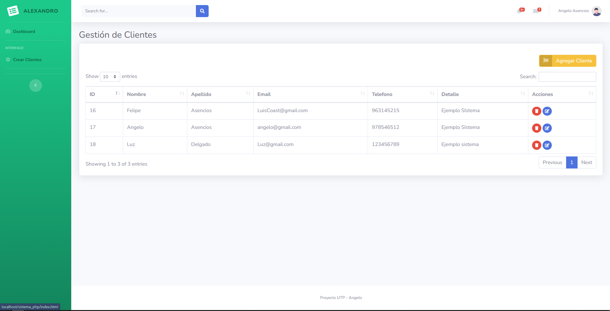
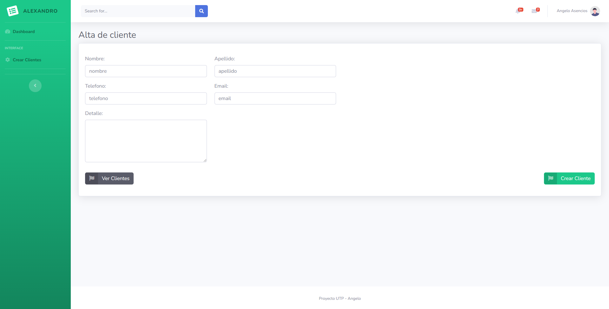
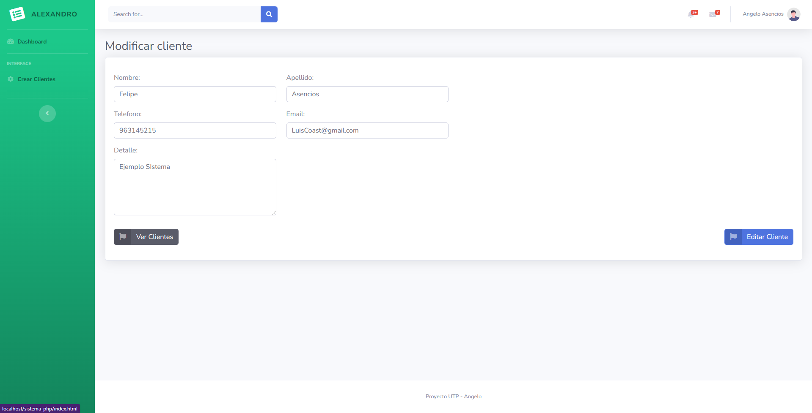

# Proyecto UTP - CRUD - PHP - MYSQL
En el presente proyecto, realice un CRUD con PHP y MySQL con la finalidad de emplear lo aprendido en la Universidad.

## Preview

### Autor
- Alexandro Asencios

### Contacto
- [aa.asencios@gmail.com](mailto:aa.asenciosg@gmail.com)
- [angelo_asenciosg@outlook.com](mailto:angelo_asenciosg@outlook.com)
